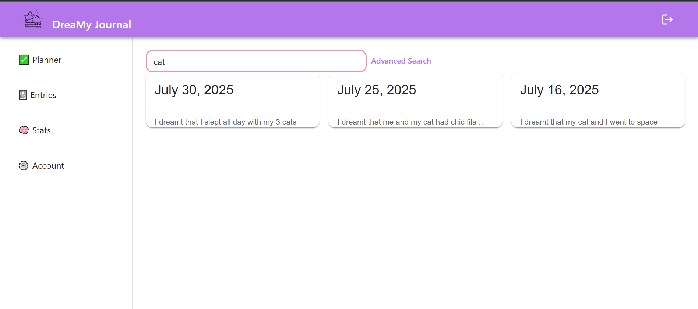

# DreaMy Journal 💤

### Description
DreaMy Journal is my full-stack PERN web application where users can privately record and reflect on their dreams. It originally started as a hackathon project titled, [DrIEEEm Journal](https://github.com/ChrisLobato/DrIEEEm-Journal) I made with my IEEE friends for HopperHacks 2024 at Stony Brook University. 

### Background
This idea came about as as the theme for the hackathon was 'sleepovers'. Myself and people I know love to recount our dreams to ourselves or friends especially if they are funny or weird but what is more interesting is that we as people like to attribute a lot of meaning to them. Therefore, the original project idea became to allow users to record their dreams in journals and leverage the Open AI API with python to generate dream interpretations and images of users dreams. However the UI wasn't very intuitive or user friendly and backend functionality was scrapped together for the 24 hour hackathon. For reference checkout our original [hackathon submission video](https://www.youtube.com/watch?v=9KkpKWbTrF8&t=5s&ab_channel=JaimaChoudhury) for our MERN app. My Goal with revamping this project is to teach myself PostgreSQL and move away from MongoDB and gain familiarity with AWS. Currently as of 7/30/2025 the original Open AI integration has been removed, and I am currently working on refactoring the basic features of the app, before adding newer functionality.

## ✨ Features

- 📝 **Create & Save Dream Entries**  
  Securely write and store your dreams, with support for editing already created entries using a calendar.

- 🔍 **Search Dreams**  
  Search for dreams by text, date, and sort paginated results by Newest or Oldest.

- 🔐 **User Authentication**  
  Sign up, log in, using JWT as the method of authentication.

- 📊 **Dream Stats Dashboard**  
  Visualize entry frequency and view dashboard of entry streaks, total entries, average word count.

## 📸 Preview





## 🛠️ Tech Stack

**Frontend**  
- React  
- Material UI (MUI)  
- Axios  
- React Router  

**Backend**  
- Node.js  
- Express  
- Prisma ORM  
- JWT-based Authentication  


## 🚀 Getting Started

### 1. Clone the Repository

```bash
git clone https://github.com/yourusername/dreamy-journal.git
cd dreamy-journal
```
### 2. Set Up the Backend
```bash
cd server
npm install
```
Create a .env file with the following:
```bash
DATABASE_URL=your_PSQL_connection_URL
APP_SECRET=your_jwt_secret
```
Then Run:
```bash
npx prisma generate
npx prisma migrate dev
nodemon index.js
```
The server will run on port 8000, I used port 5432 for my PSQL db
### 3. Set Up the Frontend
```bash
cd client
npm install
npm start
```

### 4. Access the App
http://localhost:3000/home
Currently Working on getting the app deployed on AWS...

## 👀 Planned Features
- 🌌 **AI-Powered Drafts**  
  Generate dream interpretations or visualizations using AI tools (Open AI DALL·E)
- 💤 **Sleep tracking**  
  Track hours slept every night for data visualization and analysis
- 😃 **Sentiment Analysis**   
  Analyze dreams through mood detection using a microservice.  
